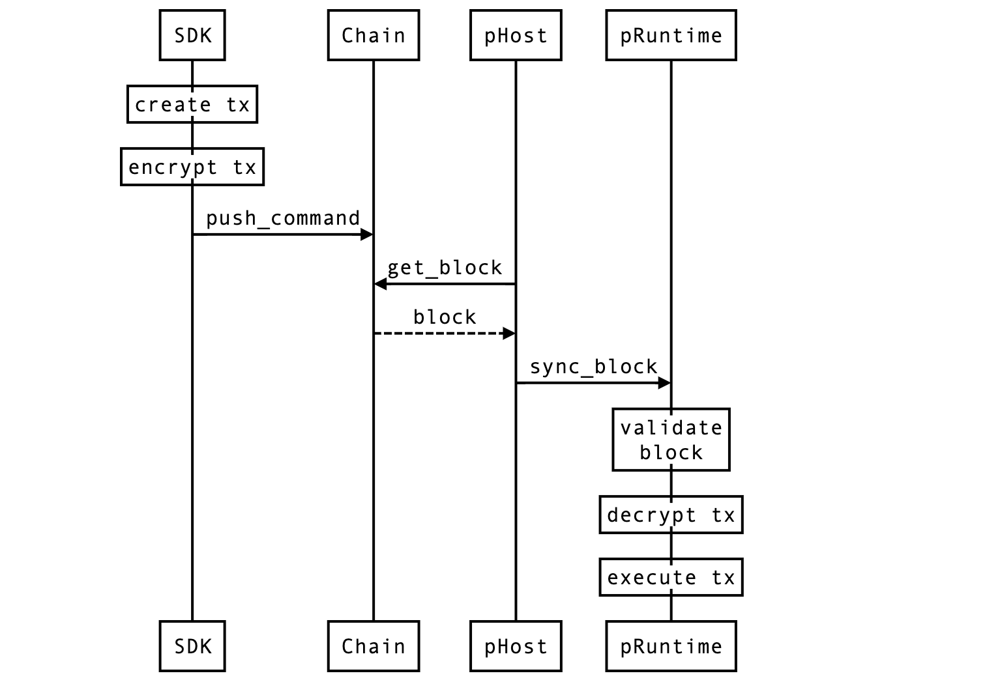

# Life of a Command



## Send a transactions

Suppose Alice wants to send Bob 1000 DEV token. She first creates a transfer command:

```js
{
  Transfer: {
    dest: "d43593c715fdd31c61141abd04a99fd6822c8558854ccde39a5684e7a56da27d",
    value: "1000000000000000"
  }
}
```

As the command will be posted to the blockchain, which is publicly accessible by everyone. So
instead of posting the plain text, she should encrypt the command so that only the confidential
contract can decrypt it.

The secret key used for the encryption is from ECDH key agreement. Alice can get the public key
of the pRuntime by `get_info` RPC. With the public key, she can derive a secret key with her own
key pair (ephemeral key).

Then the transaction is serialized to utf8 encoded binary, and encrypted by AEAD-AES-GCM-256 with
the derived secrete key. The encrypted data is base64 encoded:

```js
{
  Cipher: {
    iv_b64: "l/HeriVLadeAlTfQ",
    cipher_b64: "KWP1hr30Y9RNU90Yg4TVSAlVCiXmeuBiR5ECTidADqjRw7cT5m5O1VMPcr/AmhF4Simg98yPIrzd0Yl69DWIzGMGjiIggFlAwSjnJdvHertWF/ntlJmTG9xv/PNIvdveYZVXGTVMc8pIwgqDqIkIYtG97jJEkro5xiVGYlC74mmVQCc=",
    pubkey_b64: "BMmz1M+x8ATu4bffYJM0c3D0hGjn5Hp938Msvez+BMTR4uUAwe4zEQFbpHfKHpSGozkQVU/lE2xlzLpfZBXJU38=",
  }
}
```

Now the client is ready to send the transaction. It will invoke `execution::push_command` with the
target contract id and the encrypted messages. On our demo, the command is sent to the blockchain
by `polkadotjs` library.

The encryption is optional. It's also fine to send a message in plain text. The pRuntime can handle
both cases. The command doesn't need to be signed explicitly because the Substrate extrinsic is
signed anyway.

## Relay

The bridge `pHost` is a daemon to transmit data between the blockchain and pRuntime. It uses
`get_block` RPC to poll the block data.

After observed a new finalized block on the Substrate side, it passes the block to pRuntime by
calling `sync_block` RPC.

pRuntime treats all the incoming information as not trusted. It validates all the input blocks with
a Substrate light client. Particularly, it validates the GRANDPA block justification. So only the
finalized block can pass the check.

## Execution

If the block is not rejected by the light client, it enumerates all the push_command extrinsic in
the block and starts to dispatch the transactions.

The extrinsic has `contract_id` and `payload` fields. The payload is right the encrypted command
created by the client. Please notice that the public key used in ECDH key agreement is included
in the payload. Thus now it's the time for pRuntime to derive the secret key and decrypt the
command.

Then the transaction dispatcher passes the command to the targeted confidential contract for
execution. Note that there's no response to a transaction, just like what in Ethereum.

## See also

Demo:

- [M2: Confidential Balances Contract](./balances.md)

Deep dive:

- [Basic concept](./basic-concept.md)
- [Life of a bridge](./life-of-a-bridge.md)
- Life of a Command
- [Life of a Query](./life-of-a-query.md)

Projects:

- [phala-blockchain](https://github.com/Phala-Network/phala-blockchain): The blockchain and bridge
- [phala-pruntime](https://github.com/Phala-Network/phala-pruntime): pRuntime, the TEE worker
- [phala-polka-apps](https://github.com/Phala-Network/phala-polka-apps): The Web UI and SDK
- [plibra-grant-docker](https://github.com/Phala-Network/plibra-grant-docker): Docker build for M2
- [Technical Whitepaper](https://github.com/Phala-Network/Whitepaper)
