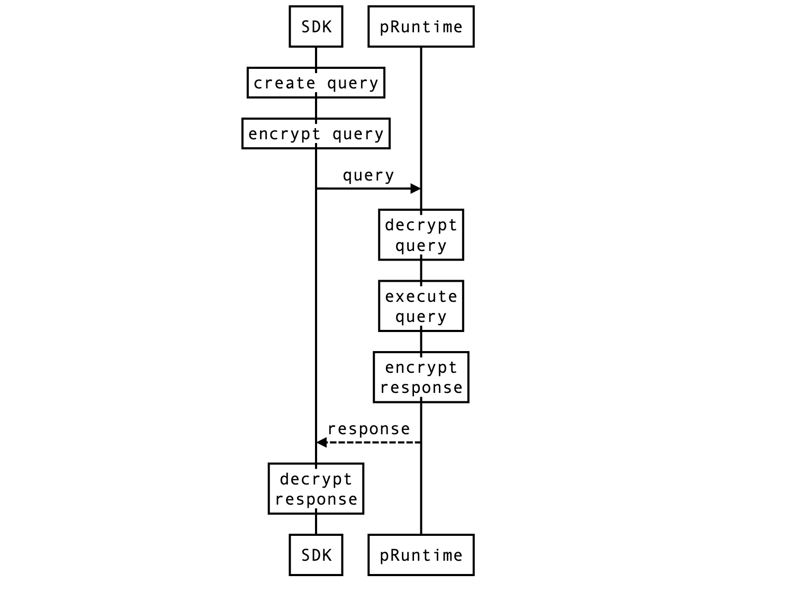

# Life of a Query



A query consists of a request-response pair. The client sends the request to pRuntime and can get
the response from pRuntime.

## Send a query

A query contains even more information than a command. Suppose Alice wants to query the balance of
her by `FreeBalance`, the SDK first creates an Query object:

```js
{
  contract_id: 2,
  nonce: 48267,
  request: {
    FreeBalance:
    account: "d43593c715fdd31c61141abd04a99fd6822c8558854ccde39a5684e7a56da27d"
  }
}
```

where the `nonce` is an random number to avoid replay attack. Unlike a command, queries are sent to
pRuntime directly. So it's necessary to include the `contract_id` inside the query. Without the help
of a blockchain, queries need to be signed as well.

The second step is to encrypt the query object just like commands:

```js
{
  Cipher: {
    iv_b64: "CYEp7INreHULzzme",
    cipher_b64: "Z965oE85R/PvVrMINHtBrrprN5ZgLf5LvdkxqtB0ibALdMTNMlk05bFOba7aYROAK2V13uQpRp7rSEB/wsCye6wjFh4cuFn2pUZFiW6FV+uxTxY9nldxbG68XJAQUbaK8h++ZgFatwiDcMncfTdL7EFq4h72N3oiggZNl41f9DzQi3iw+TNnTNnjmZuV2UYGVxXzCyxjzvc=",
    pubkey_b64: "BAehlLIq/lxLHhglZ9gxe6Q0QntP1NNFV5gnztnF9oj9AckhDbXtEfl6kMC6TUNxMBw0t9d9jxU54Z3Ct02I6qE=",
  }
}
```

And sign it with the on-chain identity:

```js
{
  query_payload: "{\"Cipher\":{\"iv_b64\":\"CYEp7INreHULzzme\",\"cipher_b64\":\"Z965oE85R/PvVrMINHtBrrprN5ZgLf5LvdkxqtB0ibALdMTNMlk05bFOba7aYROAK2V13uQpRp7rSEB/wsCye6wjFh4cuFn2pUZFiW6FV+uxTxY9nldxbG68XJAQUbaK8h++ZgFatwiDcMncfTdL7EFq4h72N3oiggZNl41f9DzQi3iw+TNnTNnjmZuV2UYGVxXzCyxjzvc=\",\"pubkey_b64\":\"BAehlLIq/lxLHhglZ9gxe6Q0QntP1NNFV5gnztnF9oj9AckhDbXtEfl6kMC6TUNxMBw0t9d9jxU54Z3Ct02I6qE=\"}}",
  origin: {
    origin: "d43593c715fdd31c61141abd04a99fd6822c8558854ccde39a5684e7a56da27d"
    sig_b64: "+D+HmELS10dmNzy3We83/4lyTPCmnfhvP/ewQ2u2wD9QXbtS5g1zI8CdLrr7bBeJCn1HEQuLLqbuOmXz03hxAA=="
    sig_type: "sr25519"
  }
}
```

The `origin` is an object with the signature and the on-chain identity (the public key). With the
identity and the signature attached, pRuntime will be able to validate the query is indeed created
by a certain person.

Both the signing and the encryption is optional. For public accessible query like `TotoalIssuance`,
the requester can just send the plain text to pRuntime.

## Process the query

Once a query arrives at pRuntime, it validates its signature and decrypt the response payload, just
like how commands are handled.

Then the request is dispatched to the targeted contract. The contract can do anything: read the
contract states, process the data, and even perform non-deterministic operations like generating
random numbers. Finally the contract must return a response.

Since the signature is included, it's up to the contract to authenticate the request. If the authenticationn failed, usually it should return an error response `NotAuthorized`.

In the case of `FreeBalance`, the contract first check if the query is signed by the same identity.
It returns the balance of the queried account:

```js
{
  FreeBalance: {
    balance: "24000000000000"
  }
}
```

or returns an error if it's not authorized:

```js
{
  Error: "NotAuthorized"
}
```

The respose is encrypted and signed by the pRuntime before sending back. Finally the client SDK
decrypts the response. In this way, the query is fully end-to-end encrypted.

## See also

Demo:

- [M2: Confidential Balances Contract](./balances.md)

Deep dive:

- [Basic concept](./basic-concept.md)
- [Life of a bridge](./life-of-a-bridge.mc)
- [Life of a Commad](./life-of-a-command.md)
- Life of a Query

Projects:

- [phala-blockchain](https://github.com/Phala-Network/phala-blockchain): The blockchain and bridge
- [phala-pruntime](https://github.com/Phala-Network/phala-pruntime): pRuntime, the TEE worker
- [phala-polka-apps](https://github.com/Phala-Network/phala-polka-apps): The Web UI and SDK
- [plibra-grant-docker](https://github.com/Phala-Network/plibra-grant-docker): Docker build for M2
- [Technical Whitepaper](https://github.com/Phala-Network/Whitepaper)
